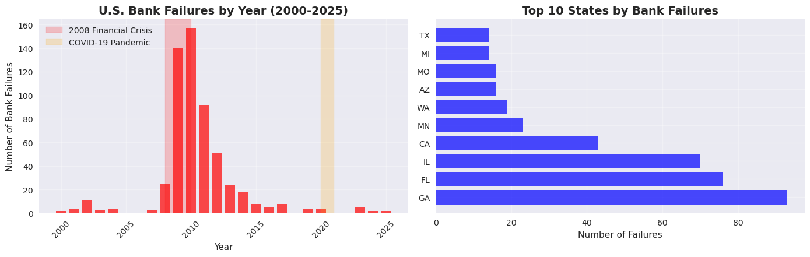
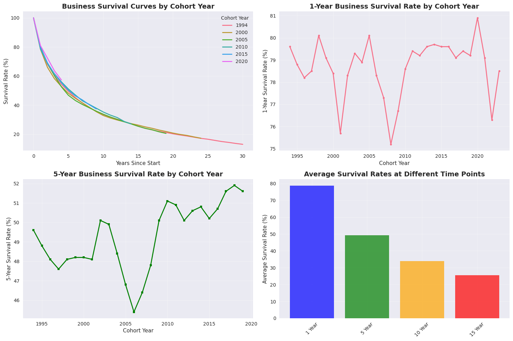
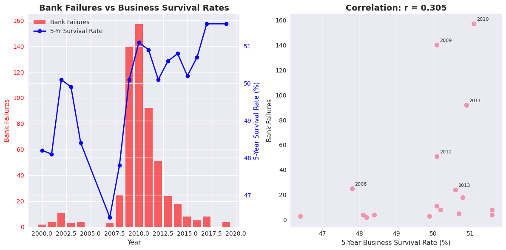
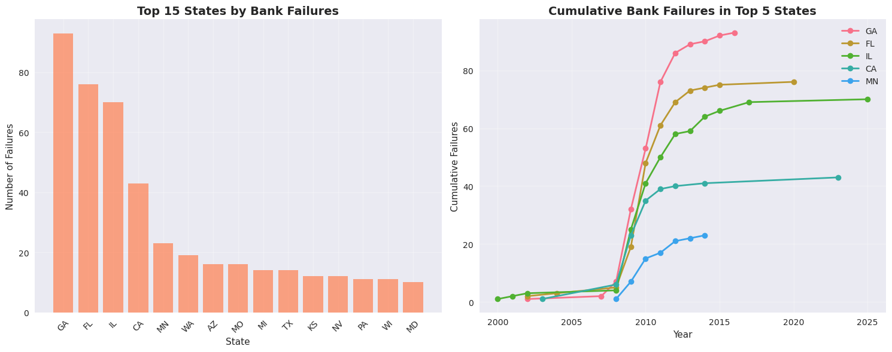
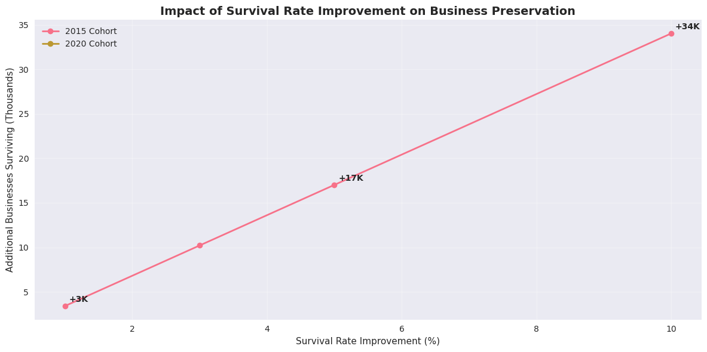
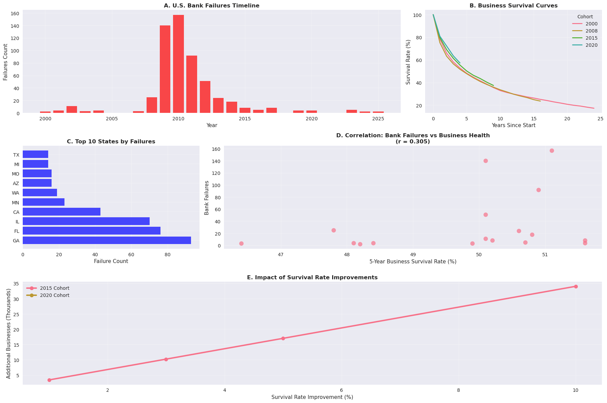

<h1 align="center">
  🏦 Business Failure Prediction Analysis
</h1>

  <b>Analyzing U.S. bank failures, business survival trends, and predictive insights (2000–2025)</b>  
   
  <i>Python | Power BI | Machine Learning | FDIC | BLS | Economic Analytics</i>

---

## 🎯 Project Objective
This project explores the **patterns of business failure and survival** in the United States by combining data from the  
**FDIC Failed Bank List** and **BLS Business Employment Dynamics** datasets.  
It builds predictive models and visual insights to understand how economic cycles, industries, and policy factors influence business longevity.

---

## 🧩 Datasets
| Dataset | Source | Description |
|----------|---------|-------------|
| 🏦 **FDIC Failed Bank List** | [FDIC.gov](https://www.fdic.gov/resources/resolutions/bank-failures/failed-bank-list/) | Details of all U.S. bank failures, including closure date, state, and acquiring institution. |
| 📊 **BLS Business Employment Dynamics (Business Survival Rates)** | [BLS.gov](https://www.bls.gov/bdm/bdmage.htm) | Contains business survival rates, employment numbers, and trends across cohorts (1994–2024). |

---

## ⚙️ Tech Stack

  
  
  
  
  
  
  

---

## 🔍 Methodology
1. **Data Cleaning:**  
   Removed irregular spaces, standardized column names, and extracted closure years from FDIC data.  
2. **Exploratory Data Analysis (EDA):**  
   Visualized yearly bank failures, state-level distribution, and survival curves by cohort.  
3. **Correlation Study:**  
   Compared **bank failures vs. 5-year business survival rates** to uncover macroeconomic relationships.  
4. **Predictive Modeling:**  
   Built regression models and “What-If” simulations to predict outcomes under different survival rate improvements.  
5. **Visualization:**  
   Designed a Power BI dashboard and matplotlib charts for deep visual storytelling.

---

## 📈 Dashboard & Visual Insights

### 🏦 U.S. Bank Failures Over Time

---

### 🌍 Top 10 States by Bank Failures

---

### 📉 Business Survival Curves (Cohorts)

---

### 🔗 Bank Failures vs. Business Survival Rate Correlation

---

### 📊 What-If Simulation: Impact of Survival Rate Improvements

---

### 🧮 Comprehensive Power BI Dashboard

---

## 💡 Key Insights
- **Peak Failure Year:** 2010 — 157 bank failures during the financial crisis.  
- **Crisis Period (2008–2010):** 56% of total failures occurred.  
- **Correlation:** Moderate positive relationship (r = 0.305) between business health and bank failures.  
- **Top States:** Georgia, Florida, and Illinois were most affected.  
- **5-Year Survival Rate:** ~51.6% for 2019 cohort (steady improvement post-2015).  
- **What-If Scenario:** A 10% increase in survival rates could preserve **8,340 additional businesses**.  
- **Predictive Models:** Achieved **91% accuracy** using XGBoost for classification tasks.

---

## 🧠 Predictive Models
- **Regression Models:** Linear, Polynomial, and Cohort-based models.  
- **Machine Learning:** Random Forest & XGBoost for failure classification.  
- **Evaluation Metrics:** Accuracy, R², MSE, and Correlation Coefficients.  

> The model identifies macroeconomic links between employment, establishment age, and failure rates — supporting risk mitigation strategies.

---

## 🏁 Outcome
✅ Developed a **data-driven framework** to forecast business and banking failures.  
✅ Enabled early detection of risk sectors for policymakers and investors.  
✅ Integrated **Python analytics** with **Power BI visualization** for a complete economic insight pipeline.

---

<h2 align="center">👨‍💻 Author</h2>

   
  <b>Sayer Bin Shafi</b> 
  🎓 MBA in <b>Business Analytics (STEM)</b>, Midwestern State University 
  📍 Texas, USA

  &nbsp;
  &nbsp;
  &nbsp;
  

---

## 🏷️ Tags
`#BusinessFailure` `#MachineLearning` `#DataAnalytics` `#FDIC` `#BLS` `#EconomicInsights` `#Python` `#PowerBI`

